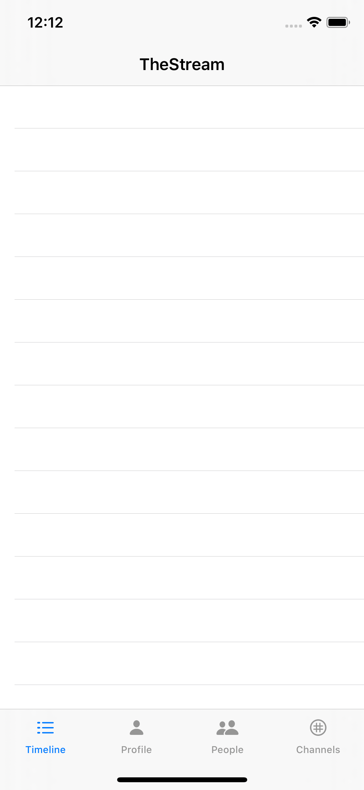
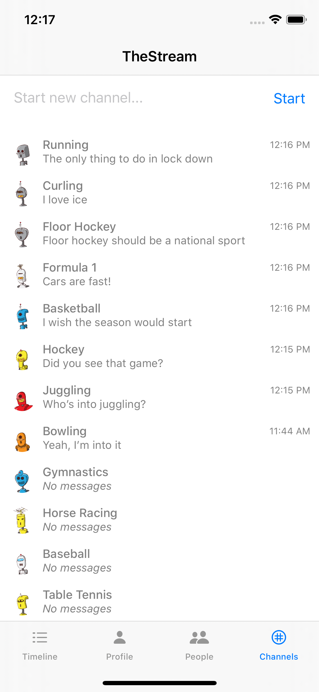
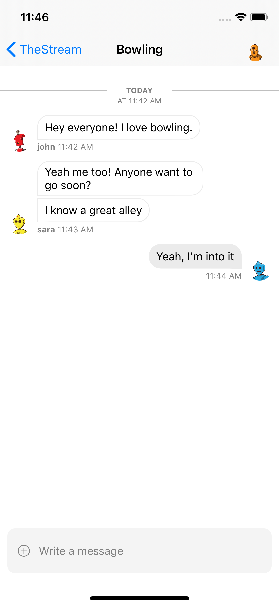

# Stream Flutter: Building a Social Network with Stream and Flutter
## Part 3: Group Channels

In the third part of our series, we're building group chat into our social application. This allows users to chat with multiple people at the same time. We leverage [Stream Chat](https://getstream.io/chat/) to do the heavy lifting. This post assumes you've gone through [part 1](https://github.com/psylinse/the-stream-swiftui/tree/1-social) and [part 2](https://github.com/the-stream-swiftui/stream-flutter/tree/2-messaging). 

Using our code from part 2, we only need to add to our iOS application, since our `backend` gives us everything we need already. To recap, the `backend` generates a frontend token for Stream Chat which allows the mobile application to communicate directly with the Stream Chat API. Also, since we have our Stream Chat dependencies already from the direct messaging implementation, there are no additional libraries. The previously installed [Swift](https://github.com/GetStream/stream-chat-swift) library is all we need.

The app goes through these steps to enable group chat:

* User navigates to a list of chat channels they can join. To start there will be none, so they must create the first one.
* The user fills out a name and clicks "Create" to create a new chat channel.
* The mobile app queries the channel for previous messages and indicates to Stream that we'd like to watch this channel for new messages. This process creates the channel in Stream. This The mobile app listens for new messages.
* The user creates a new message and sends it to the Stream Chat API. Stream broadcasts this message to all users watching that channel. 
* When the message is broadcast, including messages created by the user, the mobile application consumes the event and displays the message.

We rely on Stream's Swift libraries to do most of the work communicating with the API and rendering the chat. Similar to part 2, we leverage Stream's UI components to perform most of the steps above. If you'd like to follow along, make sure you get both the `backend` and `ios` app running part 2 before continuing.

### Adding Channels Navigation

First, we'll add a new tab to our `TabView`. Here's the new layout:

```swift
// ios/TheStream/ContentView.swift:11
@ViewBuilder
var body: some View {
    if account.isAuthed {
        NavigationView {
            TabView {
                TimelineView()
                    .tabItem {
                        Image(systemName: "list.dash")
                        Text("Timeline")
                }
                ProfileView()
                    .tabItem {
                        Image(systemName: "person.fill")
                        Text("Profile")
                }
                PeopleView()
                    .tabItem {
                        Image(systemName: "person.2.fill")
                        Text("People")
                }
                ChannelsView()
                    .tabItem {
                        Image(systemName: "grid.circle")
                        Text("Channels")
                }
            }
            .navigationBarTitle("TheStream", displayMode: .inline)
        }
    } else {
        // ...
    }
}
```

This is the same as part 2, except we add a `ChannelsView` to our tab bar. Our app now looks like this:



### Viewing Channels

Now when a user clicks on "Channels" in the `TabView` we'll show our `ChannelsView`. This view will compose two pieces together. First, we'll have a small form to create a new channel combined with an embedded Stream UI component that lists all channels given some filter. Our view looks like this:



And here's the code:

```swift
// ios/TheStream/ChannelsView.swift:5
struct ChannelsView: View {
    @EnvironmentObject var account: Account
    @State var channelName: String = ""
    
    private var channelsPresenter: ChannelsPresenter = ChannelsPresenter(filter: .in("type", ["livestream"]))
    
    var body: some View {
        VStack {
            HStack() {
                TextField("Start new channel...", text: $channelName, onCommit: createChannel)
                Button(action: createChannel) { Text("Create") }
            }.padding()
            StreamChannelsView(
                channelsPresenter: channelsPresenter
            )
        }
    }
    
    private func createChannel() {
        if (!channelName.isBlank) {
            account.createPublicChannel(channelName) { channel in
                self.channelName = ""
                self.channelsPresenter.reload()
            }
        }
    }
}
```

The top part of the view contains a form that takes a channel name, binds it to `channelName` and a button to create the channel. The second piece is a child view that wraps Stream's channel list UI component given a `ChannelsPresenter`. We'll see how this is done in a second.

First, let's see how to create a new channel. When a user clicks "Create", we invoke `account.createPublicChannel`. Once that call completes, we reset the form and reload the channels list via the `ChannelPresenter` (described next). Let's see how the `Account` instance creates the channel:

```swift
func createPublicChannel(_ name: String, completion: @escaping (Channel) -> Void) {
    let id = name
        .lowercased()
        .components(separatedBy: .whitespaces)
        .joined(separator: "-")
    
    let channel = StreamChatClient.Client.shared.channel(
        type: .livestream,
        id: id,
        extraData: ChannelExtraData(name: name, imageURL: URL(string: "https://robohash.org/\(id).png"))
    )
    
    channel.create { (result) in
        completion(try! result.get().channel)
    }
}
```

First, we convert the name into a Stream appropriate channel id. We use the previously initialized client to initialize and create a "livestream" channel. Livestream is a nice default channel type to use for a public channel such as this. If none of the default types work for your application, you can create different channel types.

Now that a channel can be created let's see how we list them. The `ChannelsView` object initializes a `ChannelsPresenter` which is a Stream class that informs their UI components what type of list we want. In our case, we're simply looking for all channels of the type "livestream". We hold a reference in `ChannelsView` so we can refresh after creating a new channel (see above).

Let's see what our `StreamChannelsView` looks like:

```swift
// ios/TheStream/StreamChannelsView.swift:33
struct StreamChannelsView: UIViewControllerRepresentable {
    var channelsPresenter: ChannelsPresenter
    
    func makeUIViewController(context: UIViewControllerRepresentableContext<StreamChannelsView>) -> ChannelsViewController {
        let vc = ChannelsViewController()
        vc.presenter = channelsPresenter
        return vc
    }
    
    func updateUIViewController(_ uiViewController: ChannelsViewController, context: UIViewControllerRepresentableContext<StreamChannelsView>) {
        
    }
}
```

Just like part 2, we use SwiftUI's `UIViewControllerRepresentable` to wrap a `UIViewController`. Swift's built-in UI components are `UIViewController`s so it's easy to wrap these with SwiftUI. Using the `ChannelPresenter` given to this class, we create a `ChannelsViewController`, which is the Stream UI component. There's nothing else to do. Stream renders a nice default channel list.

### Viewing a Group Channel

Now we're ready to view a group chat. Luckily there's no more work for us! Since the `ChannelsViewController` is nested in a `NavigationView` the rest is taken care of by Stream's library. When a user clicks on a channel, a new view is pushed on the stack representing the group chat. Here's what it looks like:



And we're done! Now we have a mini social network that allows users to chat and post status updates.