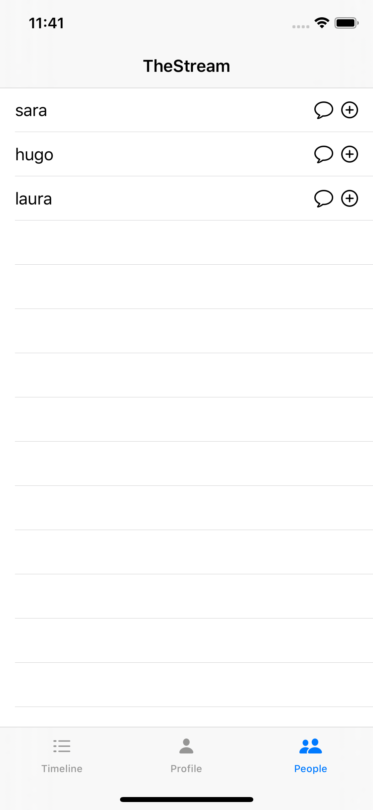
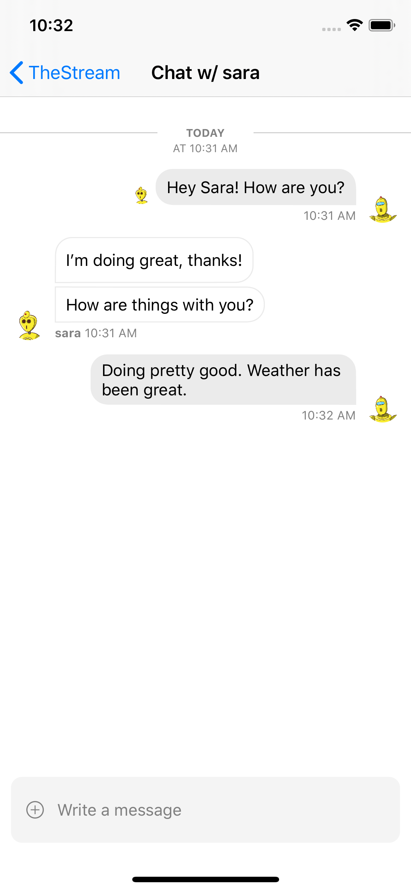

# Building a Social Network with Stream on iOS with SwiftUI
## Part 2: Direct Messaging

In the second part of our series, we'll implement direct messaging between users by integrating [Stream Chat](https://getstream.io/chat/). This post assumes you've followed along with [part 1](https://github.com/psylinse/the-stream-swiftui/tree/1-social). 

Leveraging our code from part 1, we'll modify the backend to generate a Stream Chat frontend token so our mobile application can communicate directly with Stream's Chat API. The Stream Chat frontend token securely authenticates a client application with the Stream Chat so it can directly talk with the API without going through our backend. This token is created and stored as a part of the login process which is defined in part 1. 

For this part, we'll use Stream's UI components instead of building the views ourselves to see the great UI experience we get out of the box.

For the backend, we'll add in the [Stream Chat JavaScript](https://www.npmjs.com/package/stream-chat) library. 

For the mobile app, we'll build it with Swift wrapping the Stream Chat [Swift](https://github.com/GetStream/stream-chat-swift) libraries.

The app goes through these steps to allow a user to chat with another:

* User navigates to the user list and clicks on their name or chat icon. The mobile application joins a 1-on-1 chat channel between the two users.
* The app queries the channel for previous messages and indicates to Stream that we'd like to watch this channel for new messages. The mobile app listens for new messages.
* The user creates a new message and sends it to the Stream API. 
* When the message is created, or a message from the other user is received, the mobile application consumes the event and displays the message.

Since we're relying on the Stream mobile libraries to do the heavy lifting, most of this work happens in the Stream Chat UI Components. If you'd like to follow along, make sure you get both the backend and mobile app running part 1 before continuing. Please refer to the respective package management files (Podfile, package.json) to see what versions of the libraries we're using.

## Configuring Stream Chat

To start, we need to configure Stream chat. We'll add on to the login flow that we created in part 1. Recall when we login we set up Stream. This instance of Stream is for the Stream Feed API. For chat, we need to set up a different client to interact with the Stream Chat API. Like before, we need an endpoint that creates our Stream Chat frontend token, so our mobile application can communicate directly with the Stream API. Let's check out our new endpoint:

```javascript
// backend/src/controllers/v1/stream-chat-credentials/stream-chat-credentials.action.js:6
exports.streamChatCredentials = async (req, res) => {
  try {
    const data = req.body;
    const apiKey = process.env.STREAM_API_KEY;
    const apiSecret = process.env.STREAM_API_SECRET;

    const client = new StreamChat(apiKey, apiSecret);

    const user = Object.assign({}, data, {
      id: req.user,
      role: 'user',
      image: `https://robohash.org/${req.user}`,
    });
    const token = client.createToken(user.id);
    await client.updateUser(user);

    res.status(200).json({ user, token, apiKey });
  } catch (error) {
    console.log(error);
    res.status(500).json({ error: error.message });
  }
};
```

This endpoint generates the Stream Chat frontend token. It also creates or updates the user to associate the token with the user so Stream knows who's talking to it when actions are taken in the mobile application. Using this endpoint, we can modify our login flow to request these credentials as well. We modify `.setupFeed` from part one to call to `.setupChat` after we're done with the feed setup. Here's the new version:

```swift
// ios/TheStream/Account.swift:100
private func setupFeed() {
    Alamofire
        .request("\(apiRoot)/v1/stream-feed-credentials",
            method: .post,
            headers: ["Authorization" : "Bearer \(authToken!)"])
        .responseJSON { [weak self] response in
            let body = response.value as! NSDictionary
            let feedToken = body["token"]! as! String
            let appId = body["appId"] as! String
            let apiKey = body["apiKey"] as! String
            
            if let user = self?.user {
                GetStream.Client.config = .init(apiKey: apiKey,
                                                appId: appId)
                
                
                GetStream.Client.shared.setupUser(
                    GetStreamActivityFeed.User(name: user,
                                               id: user),
                    token: feedToken
                ) { [weak self] (result) in
                    self?.userFeed = Client.shared.flatFeed(feedSlug: "user")
                    self?.timelineFeed = Client.shared.flatFeed(feedSlug: "timeline")
                    
                    self?.setupChat()
                }
            }
    }
}
```

This code is largely the same except for the last line where we call `.setupChat` instead of setting the `isAuthed` flag. Next let's look at `.setupChat`:

```swift
// ios/TheStream/Account.swift:130
private func setupChat() {
    Alamofire
        .request("\(apiRoot)/v1/stream-chat-credentials",
            method: .post,
            headers: ["Authorization" : "Bearer \(authToken!)"])
        .responseJSON { [weak self] response in
            print(response)
            let body = response.value as! NSDictionary
            let chatToken = body["token"]! as! String
            let apiKey = body["apiKey"] as! String
            
            if let user = self?.user {
                StreamChatClient.Client.config = .init(apiKey: apiKey, logOptions: .info)
                StreamChatClient.Client.shared.set(
                    user: StreamChatClient.User(id: user),
                    token: chatToken
                )
                self?.isAuthed = true
            }
    }
}
```

Here we call the endpoint we set up previously and get our frontend token. We use this to initialize the Chat Client singleton for use later. We then indicate we're authenticated via the `isAuthed` flag so the application knows we're all set up and ready to go.

## Selecting a User to Chat With
### Step 1: Adding Navigation

For this app, the chat view is it's own screen, meaning there is not tab bar when chatting. To support this we first wrap our `TabView` inside of `ContentView` with a `NavigationView`:

```swift
// ios/TheStream/ContentView.swift:11 
@ViewBuilder
var body: some View {
    if account.isAuthed {
        NavigationView {
            TabView {
                TimelineView()
                    .tabItem {
                        Image(systemName: "list.dash")
                        Text("Timeline")
                }
                ProfileView()
                    .tabItem {
                        Image(systemName: "person.fill")
                        Text("Profile")
                }
                PeopleView()
                    .tabItem {
                        Image(systemName: "person.2.fill")
                        Text("People")
                }
            }
            .navigationBarTitle("TheStream", displayMode: .inline)
        }
    } else {
        // ...
    }
}
```

This `NavigationView` wrapper allows us to push new views on the stack and provides transitions and a back button. Since we have a nice navigation bar, we add a small title to the application. The list of people now looks like this:



Notice the nice navigation bar at the top now. This is present on all screens now and automatically provides a back button if we push a new view on the navigation stack, such as our 1-on-1 chat. Let's see push a new view on the stack

### Step 2: Starting a Chat

Now that we have a `NavigationView` at the top of our hierarchy, we can build a `NavigationLink` to show the chat. Since we'd like to preserve the follow action, we'll place a start chat icon next to the follow icon. We'll also make the whole row clickable. This means that unless the user explicitly clicks the follow icon, we'll start a chat. Here's the `PeopleView` code now:

```swift
// ios/TheStream/PeopleView.swift:3
struct PeopleView: View {
    @EnvironmentObject var account: Account
    @State var users: [String] = []
    @State var showFollowedAlert: Bool = false
    @State var tag: Int? = nil
    
    var body: some View {
        List {
            ForEach(users.indices, id: \.self) { i in
                HStack() {
                    Text(self.users[i]).onTapGesture {
                        self.tag = i
                    }
                    NavigationLink(destination: PrivateChatView(user: self.account.user!, withUser: self.users[i]), tag: i, selection: self.$tag) {
                        Spacer()
                    }
                    Image(systemName: "message").onTapGesture {
                        self.tag = i
                    }
                    Image(systemName: "plus.circle").onTapGesture {
                        self.account.follow(self.users[i]) {
                            self.showFollowedAlert = true
                        }
                    }
                }
            }
        }
        .onAppear(perform: fetch)
        .alert(isPresented: $showFollowedAlert) {
            Alert(title: Text("Followed"))
        }
        
    }
    
    private func fetch() {
        account.fetchUsers { users in
            self.users = users.filter { $0 != self.account.user! }
        }
    }
}
```

The navigation is done by the `NavigationLink` embedded in the row. Since we give the content of the `NavigationLink` a `Spacer` this forces the icons to align right, while giving the whole row a clickable area. Each link is tagged with its index allowing us to "select" it when a user clicks the name or the message icon.

When a user clicks, the `NavigationLink` pushes a `PrivateChatView` onto the navigation stack. By using these built-in navigation views, we get a nice transition (swipe animation) to the next view with a back button built for us. Now we simply add our chat view in and we're done!

## Viewing a Chat
### Step 1: Creating a Channel
First, we create a channel via Streams' library. The job of `PrivateChatChannel` is to create the channel and feed it to our `StreamChatView` (defined below). Let's look at the code for `PrivateChatView`:

```swift
// ios/TheStream/PrivateChatView.swift:5
struct PrivateChatView: View {
    var user: String
    var withUser: String

    @EnvironmentObject var account: Account
    @State var channel: Channel?
    
    @ViewBuilder
    var body: some View {
        if (channel == nil) {
            Text("Loading...").onAppear(perform: loadChannel)
        } else {
            StreamChatView(channelPresenter: ChannelPresenter(channel: channel!))
                .navigationBarTitle("Chat w/ \(withUser)")
        }
    }
    
    private func loadChannel() {
        account.createPrivateChannel(user, withUser) { channel in
            self.channel = channel
        }
    }
}
```
We check if the channel has been initialized. If it's not, we show a loading screen and perform `loadChannel`. This calls to `account.createPrivateChannel`. Here's the implementation:

```swift
// ios/TheStream/Account.swift:86
func createPrivateChannel(_ user: String, _ withUser: String, completion: @escaping (Channel) -> Void) {
    let users = [user, withUser]
    let channelId = users.sorted().joined(separator: "-")
    let channel = StreamChatClient.Client.shared.channel(
        type: .messaging,
        id: channelId,
        members: users.map { StreamChatClient.User(id: $0) }
    )
    
    channel.create { (result) in
        completion(try! result.get().channel)
    }
}
```

This function generates a unique channel id and sets up a private channel that contains only the two members that are chatting. It returns the channel via the completion. 

Now that the view has a channel, it can boot a `StreamChatView`. This is a view that wraps Steam's `ChatViewController`.


### Step 2: Wrapping Stream's UI Components
In the first part of this series, we built our timeline view from scratch. In this part, we'll wrap Stream's UI components to make our jobs easier. Stream provides convenient components to render a great chat experience with little work. There are no SwiftUI components yet, however, using Swift's built-in support for `UIControllers` we can easily wrap Stream's library. Let's see the code for `StreamChatView`:

```swift
// ios/TheStream/PrivateChatView.swift:30
struct StreamChatView: UIViewControllerRepresentable {
    var channelPresenter: ChannelPresenter
    
    func makeUIViewController(context: UIViewControllerRepresentableContext<StreamChatView>) -> ChatViewController {
        let vc = ChatViewController()
        vc.presenter = channelPresenter
        return vc
    }

    func updateUIViewController(_ uiViewController: ChatViewController, context: UIViewControllerRepresentableContext<StreamChatView>) {
        
    }
}
```

We use SwiftUI's [`UIViewControllerRepresentable`](https://developer.apple.com/documentation/swiftui/uiviewcontrollerrepresentable) which allows us to create and manage a `UIViewController`. Since Stream's high-level components are `UIViewController`s this is exactly what we need to bring them into SwiftUI. 

All Stream's component needs to render is a `ChannelPresenter`. Since we instantiated this object when creating the channel, we simply use the one passed along to us by `PrivateChatChannel`. With that object, we create a `ChatViewController` instance, which comes from Stream's library, and give it the `ChannelPresenter`. Now we get a full chat experience with only a few lines of work:



And we're done. Stream's built-in views makes it straightforward to build a great chat experience. 